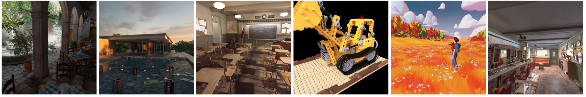

# DONeRF: Towards Real-Time Rendering of Compact Neural Radiance Fields using Depth Oracle Networks



### [Project Page](https://depthoraclenerf.github.io/) | [Video](https://youtu.be/6UE1dMUjN_E) | [Presentation](https://youtu.be/u9HqKGqvJhQ?t=5843) | [Paper](https://onlinelibrary.wiley.com/doi/10.1111/cgf.14340) | [Data](https://repository.tugraz.at/records/jjs3x-4f133)

### Licensing
The majority of this project is licensed under CC-BY-NC, except for adapted third-party code, which is available under separate license terms:

* [nerf](https://github.com/bmild/nerf) is licensed under the MIT license
* [nerf-pytorch](https://github.com/yenchenlin/nerf-pytorch) is licensed under the MIT license
* [FLIP](https://github.com/NVlabs/flip) is licensed under the BSD-3 license
* [Python-IW-SSIM](https://github.com/Jack-guo-xy/Python-IW-SSIM) is licensed under the BSD license


### General
This repository contains the source code for the paper "DONeRF: Towards Real-Time Rendering of Compact Neural Radiance Fields using Depth Oracle Networks", as well as a customized/partial port of the [nerf-pytorch](https://github.com/yenchenlin/nerf-pytorch) codebase by Yen-Chen Lin.

The codebase has been tested on Ubuntu 20.04 using an RTX2080TI with 11 GB of VRAM, and should also work on other distributions, as well as Windows, although it was not regularly tested on Windows.
Long file paths generated for experiments might cause issues on Windows, so we recommend to use a very shallow output folder (such as `D:/logs` or similar).

### Repo Structure
`configs/` contains example configuration files to get started with experiments.

`src/` contains the pytorch training/inference framework that handles training of all supported network types.

`requirements.txt` lists the required python packages for the code base. We recommend conda to setup the development environment. Note that PyTorch 1.8 is the minimum working version due to earlier versions having issues with the parallel dataloaders.


### Datasets
Our datasets follow a similar format as in the original NeRF code repository, where we read .json files containing the camera poses, as well as images (and depth maps) for each image from various directories.

The dataset can be found at [https://repository.tugraz.at/records/jjs3x-4f133](https://repository.tugraz.at/records/jjs3x-4f133).

### Training / Example Commands
To train a network with a given configuration file, you can adapt the following examplary command, executed from within the `src/` directory. All things in angle brackets `<EXAMPLE>` need to be replaced by specific values depending on your use case, please refer to `src/util/config.py` for all valid configutation options. All configuration options can also be supplied via the command line.

The following basic command trains a DONeRF with 2 samples per ray, where the oracle network is trained for 300000 iterations first, and the shading network for 300000 iterations afterwards.

```bash
python train.py -c ../configs/DONeRF_2_samples.ini --data <PATH_TO_DATASET_DIRECTORY> --logDir <PATH_TO_OUTPUT_DIRECTORY> 
```

A specific CUDA device can be chosen for training by supplying the `--device` argument:

```bash
python train.py -c ../configs/DONeRF_2_samples.ini --data <PATH_TO_DATASET_DIRECTORY> --logDir <PATH_TO_OUTPUT_DIRECTORY> --device <DEVICE_ID>
```

By default, our dataloader loads images on-demand by using 8 parallel workers. To store all data on the GPU at all times (for faster training), supply the `--storeFullData` argument:

```bash
python train.py -c ../configs/DONeRF_2_samples.ini --data <PATH_TO_DATASET_DIRECTORY> --logDir <PATH_TO_OUTPUT_DIRECTORY> --device <DEVICE_ID> --storeFullData
```

A complete example command that trains a DONeRF with 8 samples per ray on the classroom dataset using the CUDA Device 0, storing the outputs in /data/output_results/ could look like this:

```bash
python train.py -c ../configs/DONeRF_2_samples.ini --data /data/classroom/ --logDir /data/output_results/ --device 0 --storeFullData --numRayMarchSamples 8 --numRayMarchSamples 8
```

(Important to note here is that we pass numRayMarchSamples twice - the first value is actually ignored since the first network in this particular config file does not use raymarching, and certain config options are specified per network.)


### Testing / Example Commands

By default, the framework produces rendered output image every `epochsRender` iterations validates on the validation set every `epochsValidate` iterations.

Videos can be generated by supplying json paths for the poses, and `epochsVideo` will produce a video from a predefined path at regular intervals. 

For running just an inference pass for all the test images and for a given video path, you can use `src/test.py`. 

This also takes the same arguments and configuration files as `src/train.py` does, so following the example for the training command, you can use `src/test.py` as follows:

```bash
python test.py -c ../configs/DONeRF_2_samples.ini --data /data/classroom/ --logDir /data/output_results/ --device 0 --storeFullData --numRayMarchSamples 8 --numRayMarchSamples 8 --camPath cam_path_rotate --outputVideoName cam_path_rotate --videoFrames 300
```

### Evaluation

To generate quantitative results (and also output images/videos/diffs similar to what `src/test.py` can also do), you can use `src/evaluate.py`. 
To directly evaluate after training, supply the `--performEvaluation` flag to any training command.
This script only requires the `--data` and `--logDir` options to locate the results of the training procedure, and has some additional evaluation-specific options that can be inspected at the top of `def main()` (such as being able to skip certain evaluation procedures or only evaluate specific things).

`src/evaluate.py` performs the evaluation on all subdirectories (if it hasn't done so already), so you only need to run this script once for a specific dataset and all containing results are evaluated sequentially.

To aggregate the resulting outputs (MSE, SSIM, FLIP, FLOP / Pixel, Number of Parameters), you can use `src/comparison.py` to generate a resulting `.csv` file.

### Training without Groundtruth Depth (DONeRF-noGT)

In order to replicate the results presented for the DONeRF-noGT variant in our paper, you can follow these steps:

1. Train a large capacity basic NeRF which we will use to export a depth estimate from. Make sure that your depth ranges (see `dataset_info.json` in our dataset) roughly correspond to your scene, or estimate near and far ranges by using outputs from e.g. COLMAP. To train this large NeRF, you can adapt the following command (executed from within the `src/` directory):

```bash
python train.py -c ../configs/NeRF_coarse_only_128_samples_log+warp_huge.ini --data /data/classroom/ --logDir /data/output_results/ --device 0 --storeFullData --scale 1
```

2. Use `test.py` to export the necessary `XXXXX_depth.npz` depth estimates that we will later use to train a DONeRF-noGT. **Make sure that you export this at the original resolution, i.e., use `--scale 1`!**:

```bash
python train.py -c ../configs/NeRF_coarse_only_128_samples_log+warp_huge.ini --data /data/classroom/ --logDir /data/output_results/ --device 0 --storeFullData --scale 1
```

This will write all depth estimates for the `train`, `val` and `test` sets into the `/data/output_results/classroom/<large_nerf_dir>/test_images/<set>` directories. 

3. Copy the `XXXXX_depth.npz` depth estimates within those directories into the `train`, `val` and `test` directories of your dataset. If your dataset uses a different naming convention, make sure that all `_depth.npz` files correspond to the correct image within the directories of your dataset. To replicate the results of our `DONeRF-noGT` experiments, you can overwrite the existing groundtruth `_depth.npz` files with the depth estimates that were generated in the previous step.

4. Make sure that your `dataset_info.json` within your dataset directory has `"flip_depth"` and `"depth_distance_adjustment"` set to `false`, otherwise you will end up with either incorrectly flipped depth or distorted depth when training the depth oracles.

5. Your dataset should now be set up correctly, including the `_depth.npz` that were generated from a large capacity NeRF and the correct options within `dataset_info.json`. You can now proceed to train a DONeRF as described in the "Training / Example Commands" section above, which should work without any other adjustments with the same commands.


### Citation

If you find this repository useful in any way or use/modify DONeRF in your research, please consider citing our paper:

```bibtex
@article{neff2021donerf,
author = {Neff, T. and Stadlbauer, P. and Parger, M. and Kurz, A. and Mueller, J. H. and Chaitanya, C. R. A. and Kaplanyan, A. and Steinberger, M.},
title = {DONeRF: Towards Real-Time Rendering of Compact Neural Radiance Fields using Depth Oracle Networks},
journal = {Computer Graphics Forum},
volume = {40},
number = {4},
pages = {45-59},
keywords = {CCS Concepts, • Computing methodologies → Rendering},
doi = {https://doi.org/10.1111/cgf.14340},
url = {https://onlinelibrary.wiley.com/doi/abs/10.1111/cgf.14340},
eprint = {https://onlinelibrary.wiley.com/doi/pdf/10.1111/cgf.14340},
abstract = {Abstract The recent research explosion around implicit neural representations, such as NeRF, shows that there is immense potential for implicitly storing high-quality scene and lighting information in compact neural networks. However, one major limitation preventing the use of NeRF in real-time rendering applications is the prohibitive computational cost of excessive network evaluations along each view ray, requiring dozens of petaFLOPS. In this work, we bring compact neural representations closer to practical rendering of synthetic content in real-time applications, such as games and virtual reality. We show that the number of samples required for each view ray can be significantly reduced when samples are placed around surfaces in the scene without compromising image quality. To this end, we propose a depth oracle network that predicts ray sample locations for each view ray with a single network evaluation. We show that using a classification network around logarithmically discretized and spherically warped depth values is essential to encode surface locations rather than directly estimating depth. The combination of these techniques leads to DONeRF, our compact dual network design with a depth oracle network as its first step and a locally sampled shading network for ray accumulation. With DONeRF, we reduce the inference costs by up to 48× compared to NeRF when conditioning on available ground truth depth information. Compared to concurrent acceleration methods for raymarching-based neural representations, DONeRF does not require additional memory for explicit caching or acceleration structures, and can render interactively (20 frames per second) on a single GPU.},
year = {2021}
}
```


